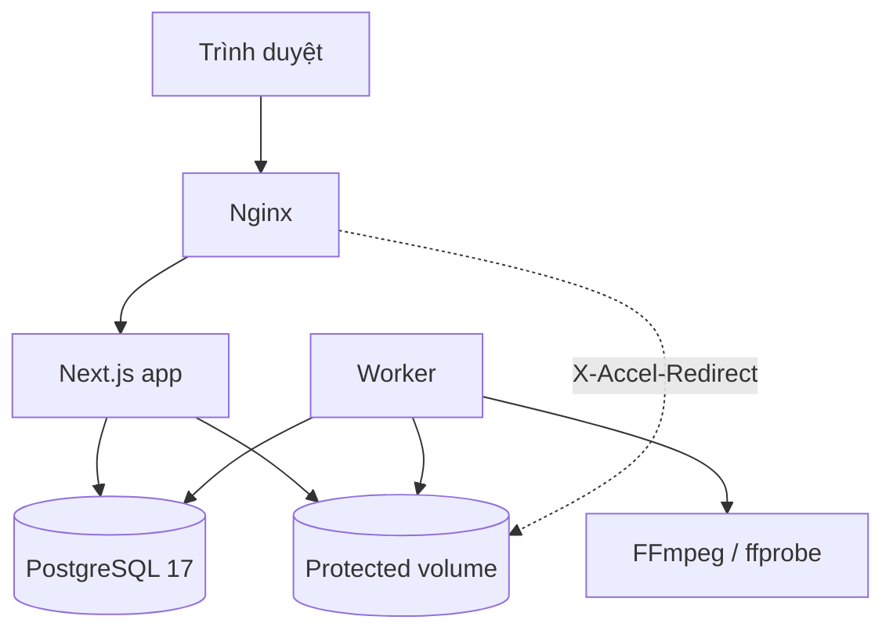
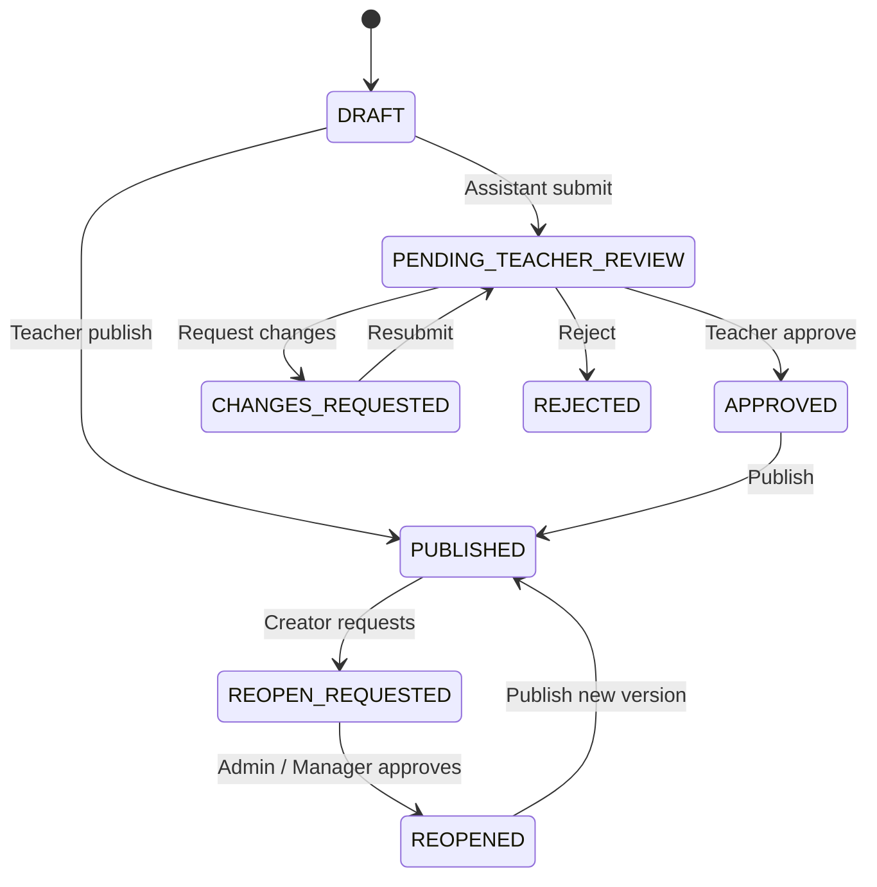

# Kiến trúc và mô hình dữ liệu

## Kiến trúc runtime

- Nginx là điểm vào duy nhất, áp dụng rate/connection limit và phục vụ file
  nội bộ sau khi app cấp `X-Accel-Redirect`.
- Next.js chứa Server Components, Better Auth và API route handlers.
- PostgreSQL là nguồn sự thật cho auth, nghiệp vụ, rate limit, job và audit.
- Worker claim một job bằng `FOR UPDATE SKIP LOCKED`, xử lý ngoài request rồi
  ghi kết quả về database.
- Protected volume không nằm trong `public`; chỉ app, worker và Nginx được
  mount.

## Ranh giới module

| Module          | Trách nhiệm                                 |
| --------------- | ------------------------------------------- |
| `auth`          | Google OAuth, session, trạng thái tài khoản |
| `authorization` | role, quan hệ lớp, student/parent ownership |
| `users`         | tài khoản tạo sẵn, khóa/xóa mềm, hồ sơ      |
| `classes`       | lớp, sức chứa, phân công và chuyển học sinh |
| `sessions`      | lịch, xung đột thời gian, link phòng học    |
| `contents`      | content chung, review, publish, version     |
| `assignments`   | autosave, nộp, chấm và công bố              |
| `quizzes`       | attempt, đồng hồ server, đáp án an toàn     |
| `attendance`    | join, manual mark, finalize, audit          |
| `recordings`    | phát video, concurrent session, progress    |
| `reports/jobs`  | tác vụ nền, retry, export                   |
| `storage`       | kiểm file, đường dẫn, phân quyền tải xuống  |

## Mô hình dữ liệu

Nhóm auth:

- `User`, `Profile`, `Session`, `Account`, `Verification`, `RateLimit`.
- `Account` lưu token OAuth ở dạng AES-256-GCM, không có endpoint trả token.

Nhóm tổ chức lớp:

- `Subject`, `CourseClass`.
- `ClassTeacher`, `ClassAssistant`, `ClassStudent`.
- `ParentStudentLink`.
- `ClassSession`.

Nhóm nội dung:

- `Content` là aggregate root, bắt buộc có `classId` và `classSessionId`.
- Bảng chi tiết 1–1: `Lesson`, `Recording`, `Material`, `Assignment`, `Quiz`.
- `ContentReview`, `ContentReopenRequest` và self-relation
  `previousVersionId` lưu workflow/version.
- Câu hỏi/lựa chọn tách riêng cho assignment và quiz; trường `isCorrect` không
  xuất hiện trong response dành cho learner.

Nhóm hoạt động:

- `Submission`, `SubmissionAnswer`, `SubmissionFile`.
- `QuizAttempt`, `QuizAnswer`.
- `Attendance`, `AttendanceAudit`.
- `VideoProgress`, `VideoViewSession`.

Nhóm vận hành:

- `Asset`, `Report`, `Job`, `AuditLog`, `PermissionGrant`, `SystemSetting`.

## Ràng buộc quan trọng ở database

- UUID cho khóa chính; unique index cho email, code, membership và attempt.
- Check constraint cho capacity, ngày lớp, cửa sổ assignment/quiz, phần trăm
  video và số lần retry.
- Partial unique index bảo đảm một giáo viên chính đang hoạt động và một phụ
  huynh chính cho mỗi học sinh.
- Trigger bảo đảm `Content.classId` luôn khớp lớp của `ClassSession`.
- Trigger chặn `UPDATE`/`DELETE` trên `AuditLog`.
- Trigger ghi dấu vết thay đổi `Attendance`.
- Optimistic lock `CourseClass.version` và transaction serializable/row lock
  cho thao tác capacity/transfer.

## Workflow nội dung

Published content bị khóa. Khi mở lại, service clone toàn bộ aggregate thành
version mới và giữ liên kết tới version trước.

## Luồng video

1. Nhân sự tải asset vào protected storage.
2. Tạo content video sinh job `PROCESS_VIDEO`.
3. Worker dùng ffprobe lấy metadata, FFmpeg tạo HLS và thumbnail.
4. Learner gọi route authorize; server kiểm session, trạng thái user, quyền
   lớp, publication và concurrent sessions.
5. App viết lại manifest để gắn `viewSessionId`; Nginx chỉ phục vụ file gốc và
   từng segment qua `X-Accel-Redirect` sau khi route kiểm quyền.
6. Client hiển thị watermark từ header và gửi progress định kỳ; server giới hạn
   watched delta để giảm gian lận.
